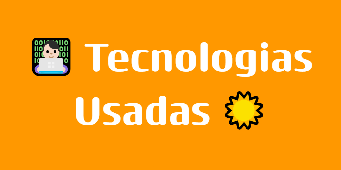
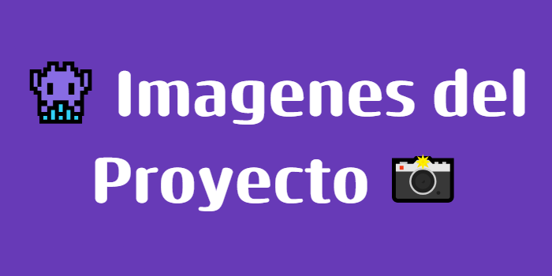
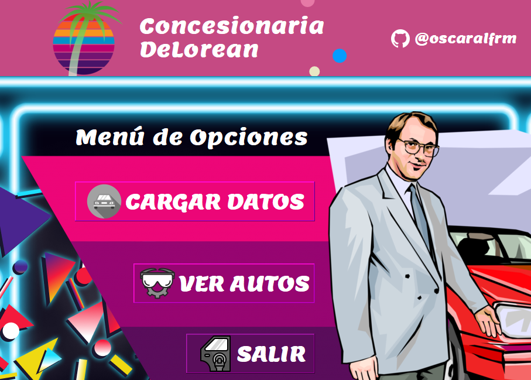
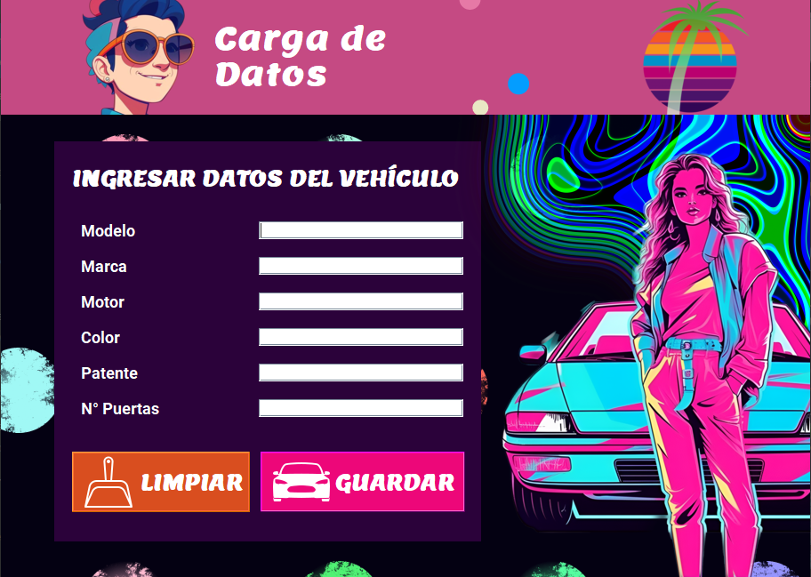
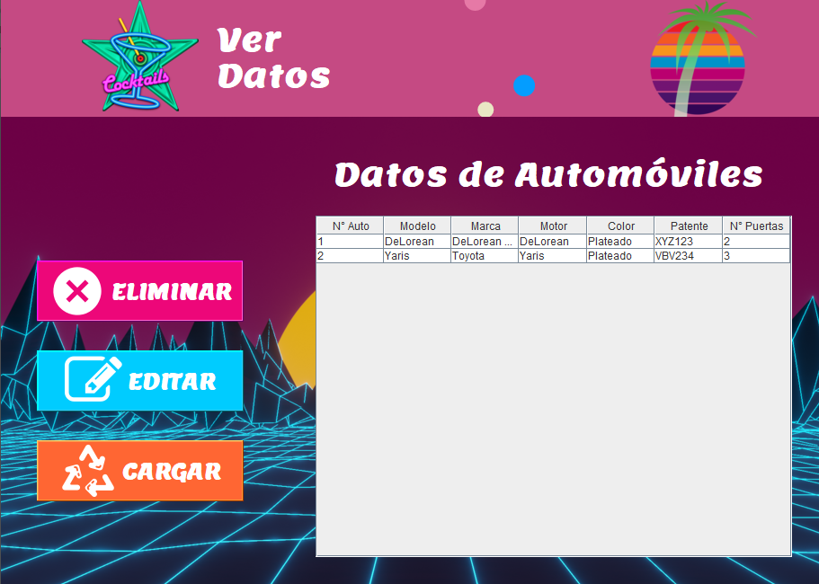
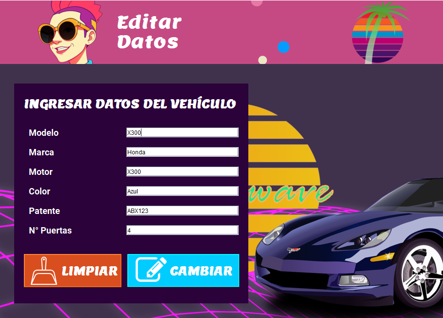

<section align="center">
  

La aplicación desarrollada con temática de Concesionaria de Autos fue hecha como parte del curso "Programación Orientada a Objetos con Java" de la Academia TodoCode: https://todocodeacademy.com/course/programacion-orientada-a-objetos-con-java/

Se pudo ahondar sobre los siguientes conceptos de la POO, empleando como lenguaje de programación a Java:

- <strong>CRUD (Altas-Bajas-Modificación-Consulta)</strong> sobre una Concesionaria de Autos, se decidió trabajar sobre el requerimiento de la creación de una clase "Vehículo".
- <strong>Modelo de 3 capas (Interfaz Gráfica de Usuario o GUI, Lógica y Persistencia)</strong>. El usuario ingresa los datos a través de una interfaz gráfica (GUI, para ver su representación
terminada, leer el final del documento en donde se adjuntan capturas de pantalla del mismo) y los datos pasarán a través de una capa lógica para llegar, posteriormente, a ser almacenados
en una Base de Datos Relacional.
- <strong>Bases de Datos Relacionales</strong>: Con el Sistema Gestor de Bases de Datos MySQL, para la persistencia de los datos ingresados por el usuario.
- <strong>JPA</strong>: Java Persistence API, para el mappeo de las Entidades (Clases). Se utilizó el proveedor EclipseLink (en futuros proyectos se empleará el proveedor Hibernate).

El mismo proyecto también formó parte de un desafío mensual, en la que se le indica a los alumnos desarrollar una aplicación de escritorio, con Java Swing y herramientas de persistencia,
que facilite el mantenimiento de los datos de registros de la clase Vehículo. La finalidad es acercar al alumno al aprendizaje de conceptos que serán fundamentales en futuras iteraciones
y desafíos del curso.

  

  

Dentro de las tecnologías implementadas en el marco del proyecto, se usaron:

  

  

  

En el siguiente desafío de aprendizaje reafirmamos lo aprendido mediante el trabajo del desarrollo de <strong>CRUDs (ABMCs)</strong> del ejercicio anterior, además de poder afianzar competencias como lo es el manejo
de una interfaz que pueda acoplar los requerimientos del usuario y poder captar sus necesidades de la lógica de negocio en una aplicación de escritorio. La necesidad de la comprensión de éstas operaciones básicas será crucial más adelante cuando trabajemos en la creación de <strong>APIs REST</strong>, usando <strong>Springboot</strong>.

  

Entre algunas de las pantallas disponibles para su visualización en el presente proyecto, se presentan las pantallas de <strong>Menú Principal</strong>, <strong>Carga de Datos</strong>, <strong>Visualización de Datos</strong> y 
  de <strong>Edición de los Registros:</strong>.
  

  

  

</section>
